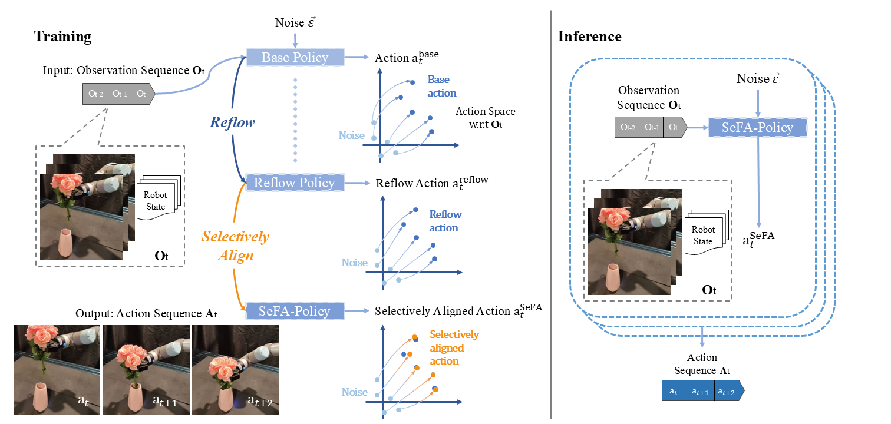

# SeFA-Policy: Fast and Accurate Visuomotor Policy Learning with Selective Flow Alignment

[[Project page]](https://github.com/RongXueZoe/SeFAPolicy-homepage/)
[[Paper]](https://?/#paper)

[Rong Xue](http://rongxuezoe.github.io/)<sup>1*</sup>,
[Jiageng Mao](https://pointscoder.github.io/)<sup>1*</sup>,
[Mingtong Zhang](https://robo-alex.github.io/)<sup>1</sup>,
[Yue Wang](https://yuewang.xyz/)<sup>1</sup>,

<sup>1</sup>University of Southern California,





## 🛠️ Installation
To reproduce our simulation benchmark results, install our conda environment on a Linux machine with Nvidia GPU. On Ubuntu 20.04 you need to install the following apt packages for mujoco:
```console
$ sudo apt install -y libosmesa6-dev libgl1-mesa-glx libglfw3 patchelf
```

We provide two ways of installation:
1. Dockerfile under repo root is for docker installation:
    ```console
    $ docker build -t sefapolicy:latest .
    ```

2. We recommend [Mambaforge](https://github.com/conda-forge/miniforge#mambaforge) instead of the standard anaconda distribution for faster installation: 
    ```console
    $ mamba env create -f environment.yaml
    $ mamba activate sefapolicy
    ```

    but you can use conda as well: 
    ```console
    $ conda env create -f environment.yaml
    $ conda activate sefapolicy
    ```

    Then install extra packages:
    ```console
    (sefapolicy)$ pip install garage --no-deps
    (sefapolicy)$ cd third_party
    (sefapolicy)[third_party]$ cd dexart-release && pip install -e . && cd ..
    (sefapolicy)[third_party]$ cd rrl-dependencies && pip install -e mj_envs/. && pip install -e mjrl/. && cd .. && cd ..
    (sefapolicy)$ pip install natsort
    ```


## 📥 Download Training Data
Under the repo root, create data subdirectory:
```console
[sefa_policy]$ mkdir data && cd data
```

For __Push-T__, __Franka Kitchen__ and __RoboMimic__, download the corresponding zip file from [https://diffusion-policy.cs.columbia.edu/data/training/](https://diffusion-policy.cs.columbia.edu/data/training/).
```console
[data]$ wget https://diffusion-policy.cs.columbia.edu/data/training/pusht.zip
[data]$ wget https://diffusion-policy.cs.columbia.edu/data/training/kitchen.zip
[data]$ wget https://diffusion-policy.cs.columbia.edu/data/training/robomimic_image.zip
```

Extract training data:
```console
[data]$ unzip pusht.zip && rm -f pusht.zip && unzip kitchen.zip && rm -f kitchen.zip && unzip robomimic_image.zip && rm -f robomimic_image.zip
```

For the 50 tasks in __Meta-World__, download [mt50](https://drive.google.com/drive/folders/1aHRAxm16WAsKEIOiSfy66p29jOTf0GQS?usp=sharing) into data folder and extract the zip file:
```console
[data]$ unzip metaworld.zip && rm -f metaworld.zip
```

For __Adroit__ tasks, follow [3D Diffusion Policy](https://github.com/YanjieZe/3D-Diffusion-Policy) to generate training samples and save them into `data/adroit`.

## 🖥️ Training:
Activate conda environment:
```console
[sefa_policy]$ mamba activate sefapolicy
```

Login to [wandb](https://wandb.ai) (if you haven't already). If you do not want to use  [wandb](https://wandb.ai), please skip this step and pass `use_wandb=false` during training.
```console
(sefapolicy)[sefa_policy]$ wandb login
```

The configuration files of ours and baselines are provided under folder `sefa_policy/config`. Here we take `Meta-World` dataset as an example. A `task.env_name` is required when training tasks in `Meta-World`.

### 🙂 Train Base Policy:
This will launch training with default seed 42 on GPU 0:
```console
python train.py --config-name=train_sefa_unet_hybrid_metaworld task.env_name=[env_name]
```

### 😀 Perform Selective Flow Alignment:
When generating couplings via _Selective Flow Alignment_, 
1. pass `mode=gen_data`,
2. set `base_ckpt` as the designated path to your base checkpoint,
3. name `sefa_name` as your SeFA data's name.
```console
python train.py --config-name=train_sefa_unet_hybrid_metaworld task.env_name=[env_name] mode=gen_data base_ckpt=[path to your base checkpoint] sefa_name=[your SeFA data's name]
```

### 🥳 Train SeFA Policy:
When training _SeFA Policy_, 
1. pass `mode=sefa`,
2. set `base_ckpt` as the path where your base checkpoint is saved,
3. pass `sefa_name` as the same SeFA data's name used when generating couplings via _Selective Flow Alignment_.
```console
python train.py --config-name=train_sefa_unet_hybrid_metaworld task.env_name=[env_name] mode=sefa base_ckpt=[path to your base checkpoint] sefa_name=[your SeFA data's name]
```

## 🔍 Evaluation
Run the evaluation script:
```console
(sefapolicy)[sefa_policy]$ python eval.py --checkpoint [path to your checkpoint] --output_dir data/metaworld_eval_output --device cuda:0
```

This will generate the following directory structure:
```console
(sefapolicy)[sefa_policy]$ tree data/metaworld_eval_output
data/metaworld_eval_output
├── eval_log.json
└── media
    ├── 1fxtno84.mp4
    └── 3p7jqn32.mp4

1 directory, 3 files
```

`eval_log.json` contains metrics that is logged to wandb during training:
```console
(sefapolicy)[sefa_policy]$ cat data/metaworld_eval_output/eval_log.json
{
  "test/mean_success_rate": ...,
  "test/sim_max_reward_[seed_0]": ...,
  "test/sim_max_reward_[seed_1]": ...,
...
  "train/sim_video_1": "data/metaworld_eval_output/media/2fo4btlf.mp4"
}
```

## 🏷️ License
This repository is released under the MIT license. See [LICENSE](LICENSE) for additional details.

## 🙏 Acknowledgement
* The [Diffusion Policy](./sefa_policy/policy/diffusion_unet_hybrid_image_policy.py) baseline is adapted from [Cheng Chi's implementation](https://diffusion-policy.cs.columbia.edu/).
* The [Robomimic](https://github.com/ARISE-Initiative/robomimic) tasks and [`ObservationEncoder`](https://github.com/ARISE-Initiative/robomimic/blob/master/robomimic/models/obs_nets.py) are used extensively in this project.
* The [Push-T](./sefa_policy/env/pusht) task is adapted from [IBC](https://github.com/google-research/ibc).
* The [Adroit](./sefa_policy/env/adroit) tasks are adapted from [3D Diffusion Policy](https://github.com/YanjieZe/3D-Diffusion-Policy).
